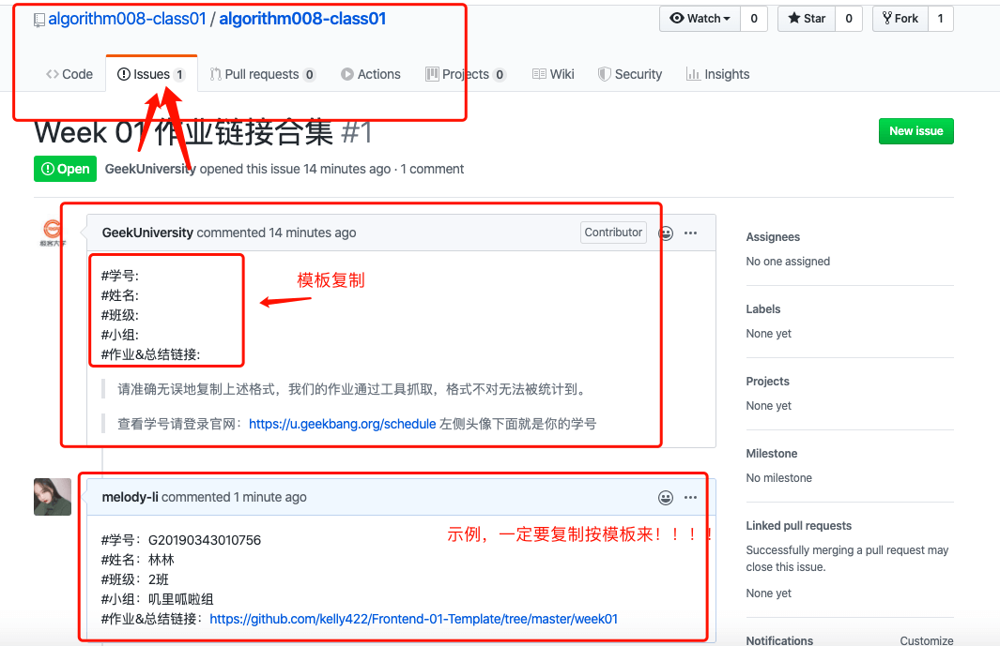

# 作业提交规范

1. Fork训练营作业仓库 
2. clone 到本地并在对应 Week 中完成对应内容
3. 将该周作业链接，按格式跟帖进行 comment 贴到班级仓库对应学习周的issue下面。

**格式：**
```
#学号:
#姓名:
#班级:
#语言:
#作业链接:
#总结链接:
```



算法训练营11期Github地址：https://github.com/algorithm011-class01/algorithm011-class01