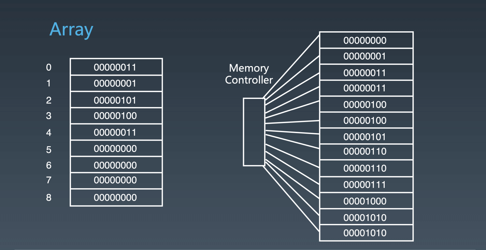
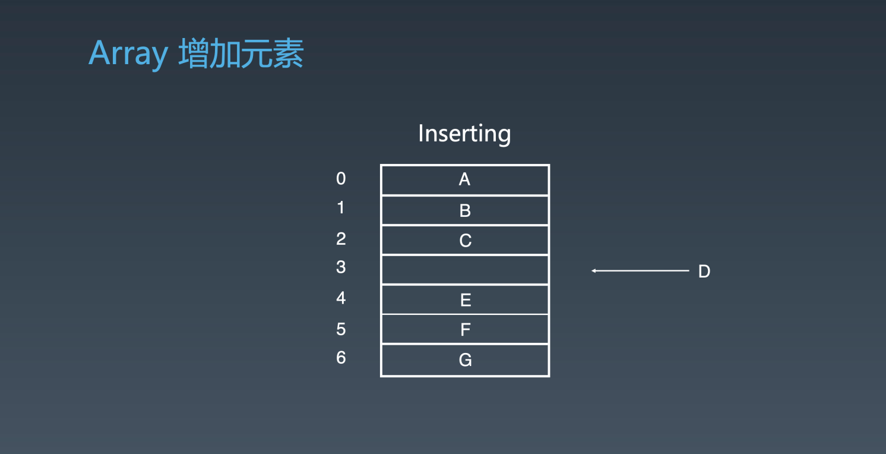
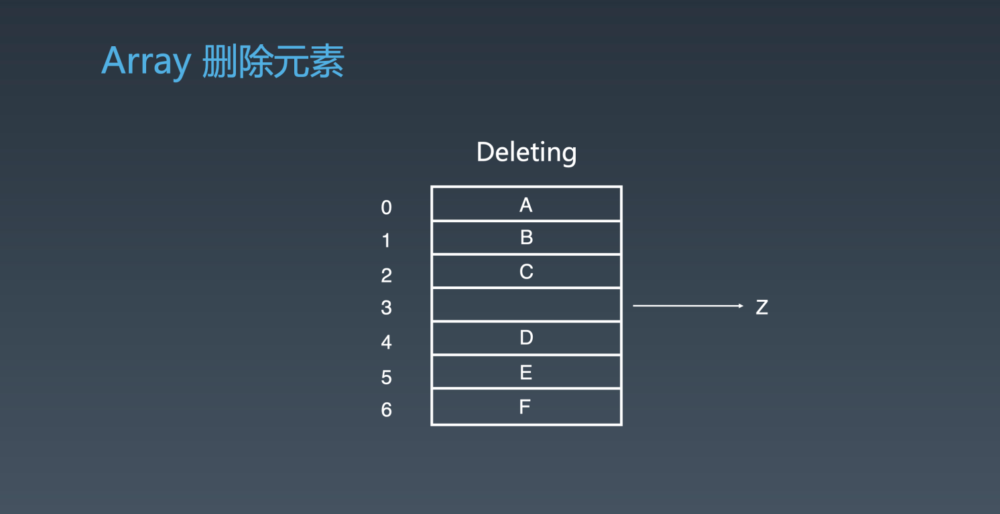
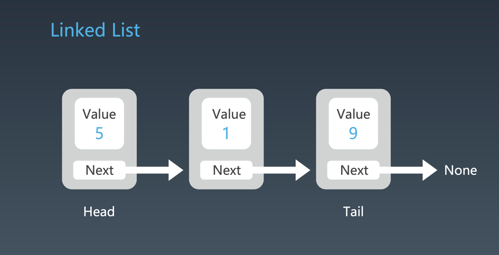
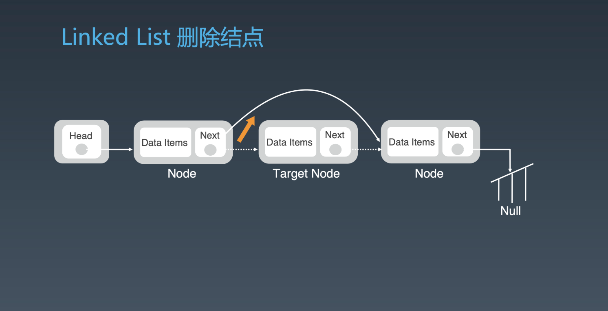
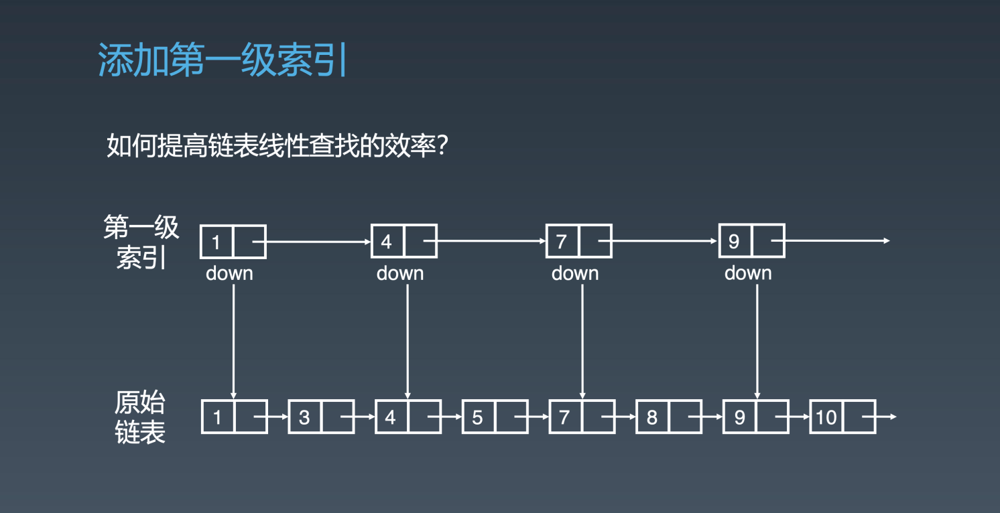
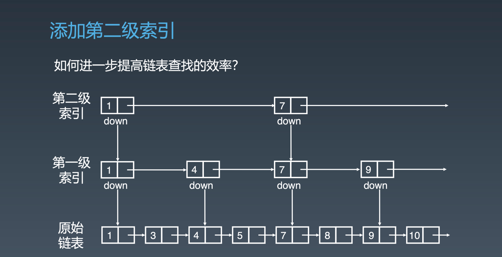
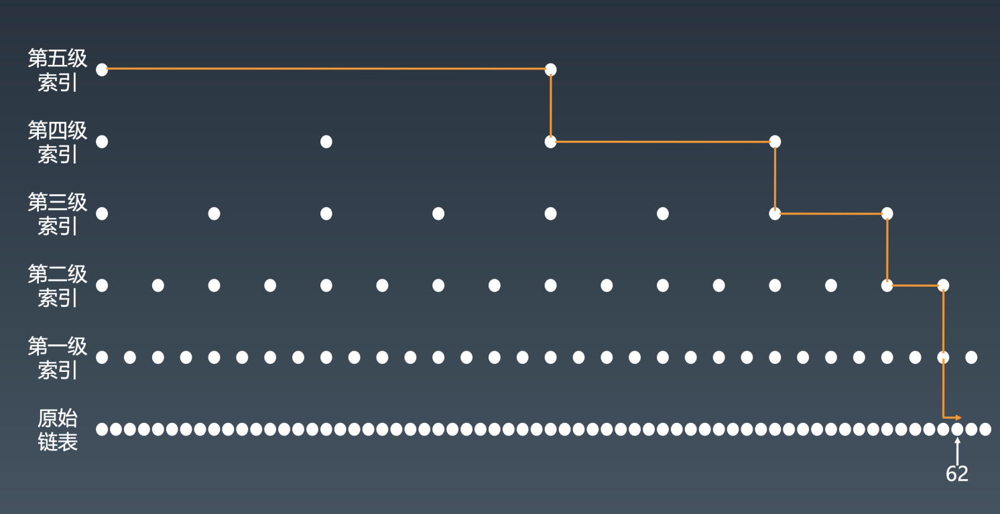

# 数组、链表、跳表的基本实现和特性

## 数组
数组的常见写法：
```bash
Java,C++: int a[100];
Python: list = []
JavaScript: let x = [1,2,3]
```
对于数组里面的元素类型没有严格要求，任何一个单元类型都可以放进去，在语言上称之为泛型。



数组的底层实现通过内存管理器，每当你申请数组，计算器实际上是在内存中开辟一段连续的地址。每一个地址可以直接通过内存管理器访问，直接访问第一个元素和其中的任意一个元素时间复杂度都一样，也就是常数时间称为 O(1) 。

**数组增加元素**



假设数组为 A、B、C、E、F、G 他们所对应的下标(index) 分别为 0、1、2、3、4、5。这时候有一个元素 D 要插入到数组中，E、F、G 都需要往下挪动一个位置把 index 3 的位置让出来。由于我们必须要移动 E、F、G，在最坏情况下要挪动整个数组 O(n)，在最好的情况下插入到最后只需要挪动 1 个 O(1)。

**数组删除元素**


假设数组 A、B、C、Z、D、E、F，我们需要把 z 从 index 3 的位置清除掉。这时候我们需要的操作为把 z 删除，然后把 D、E、F 往前挪动。同样最坏情况下的时间复杂度为 O(n) ，最好情况下为 O(1) 。


## 链表
在一些修改、添加、删除操作比较频繁的情况下，数组其实不太好用，我们可使用链表。它所做的一件事情就是元素定义好之后它有所谓的 value 和 next ，next 指向下一个元素，串在一起就变成了一个类似与数组的结构。



它的每一个元素一般用 class 来定义，这个 class 一般叫做 node ，里面有 2 个成员变量 value 和 next 。如果 node 中只有一个 next 指针的话我们叫做单链表 ，如果往前面也有一个先前指针 prev 我们称之为双向链表。他们的头指针我们一般用 Head 表示，尾部指针用 Tail 来表示，最后一个元素它的 next 指向为空 None 。如果最后一个元素 Tail 的 next 指针指向的是 Head 来，这个时候称之为循环链表。


**链表添加节点**



开始时候是一原始的链表，共有 2 个节点，现在需要新加入一个元素 New Node 。假设我们要在第二个位置插入，第一个元元素（Node A）和第二个元素（ Node B ）之间。这时候我们只需要把第一个元素（ Node A）的 next 指针指向 New Node ，把 New Node 的 next 指针指向原来的第二个元素（Node B ）。这里的添加操作需要操作 2 次为常数性的所以时间复杂度为 O(1) 。


**链表的节点删除**



删除节点是增加节点的逆操作，假设要删除的节点为新加入的节点 Target Node 。需要的操作是把它前一个元素的 next 指针指向到它的下一个元素中去。


**链表的查看访问**

在增加、删除链表中没有涉及到群移操作，也不需要复制元素。所以它的添加、删除的效率非常高为 O(1) 。但是也就因为这样的结构，导致需要访问其中的某一个元素变得不那么简单，必须从头节点一步一步的往后挪动，为 O(n) 的复杂度。


## 跳表
跳表是基于链表中查询时间复杂度为 O(n) 而生的，**它只能用于元素有序的情况**。跳表对标的是平衡树( AVL Tree )和二分查找，是一种插入/删除/搜索都为 O( log n ) 的数据结构。它最大的优势是原理简单、容易实现、方便扩展、效率更高。因此在一些热门的项目中用来替代平衡树，如 Redis、LevelDB 等。



假设一个有序的链表 1、3、4、5、7、8、9 、10 它的查询时间复杂度为 O(n) ，如何优化可以让它的查询时间复杂度变低。
> 一维数据结构加速，经常采用的方法是升维，也就是变成二维。多一个维度，就会有多一级的信息在里面，这样就可以很快的得到一维里面你必须挨个走才能走到的那些元素。



在原始链表的情况下，我们再增加一个维度，也就是在上面增加一层索引，称之为第一级索引。它的 next 指向上一级索引 + 1 的元素，也就是 next + 1 元素，跳过一个。


假设我们需要查询 7 的话，我们可以先查询一级索引 1、4、7 ，寻找到了证明在这个链路中是存在的。如果需要查询 8 的话，它的在一级索引查询顺序是 1、4、7、9 ，8 在 7 、9 之间，所以从一级索引中的 7 向下走，回到原始链表中在开始一个个的找，下一个 8 就找到了。


添加一级索引，相当于步伐加大了为 2 ，能不能快更多呢。同理可得在第一级的索引上，我们把它当作原始连表一样，网上再加一层索引。这样在第二级索引上走 1 步，相当于原始链表中走了 4 步。这寻找 8 的时候，它在二级索引的顺序是 1、7 ，往下第二层索引中 7 ，再往下原始链表中的 7 查询到 8。



由始类推我们就可以增加多级的索引，第三级、第四级、第五级。


**跳表查询的时间复杂度分析**

n/2、n/4、n/8 第 k 层级索引结点个数是 n/(2^k)
假设索引有 h 级别，最高的索引有 2 个节点。n/(2^h) = 2，h = log2(n) - 1
因此跳表中查询任意数据的时间复杂度为 O(logn)

**现实中跳表的形态**

在现实当中我们使用跳表的情况，会由于元素的增加和删除导致索引发生改变，索引有时候会多跨几步或者少跨几步。并且维护成本比较高，如果需要添加和删除为了索引准确，需要把它的索引更新一遍。这种过程中增加和删除它的时间复杂度也会变成 O(logn) 。

## 参考链接

- [Java 源码分析（ArrayList）](http://developer.classpath.org/doc/java/util/ArrayList-source.html)
- [Linked List 的标准实现代码](http://www.geeksforgeeks.org/implementing-a-linked-list-in-java-using-class/)
- [Linked List 示例代码](http://www.cs.cmu.edu/~adamchik/15-121/lectures/Linked%20Lists/code/LinkedList.java)
- [Java 源码分析（LinkedList）](http://developer.classpath.org/doc/java/util/LinkedList-source.html)
- LRU Cache - Linked list：[ LRU 缓存机制](http://leetcode-cn.com/problems/lru-cache)
- Redis - Skip List：[跳跃表](http://redisbook.readthedocs.io/en/latest/internal-datastruct/skiplist.html)、[为啥 Redis 使用跳表（Skip List）而不是使用 Red-Black？](http://www.zhihu.com/question/20202931)
