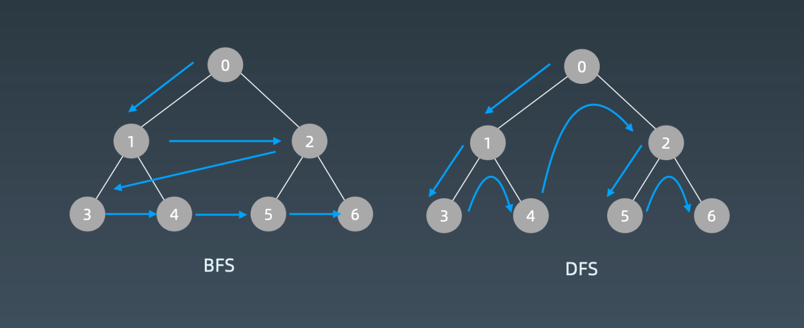
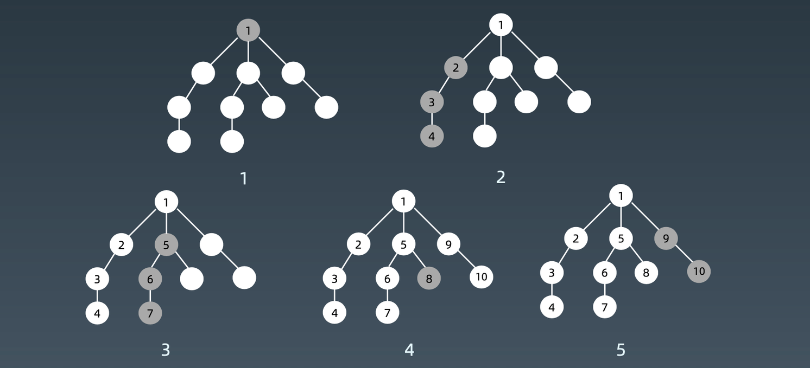
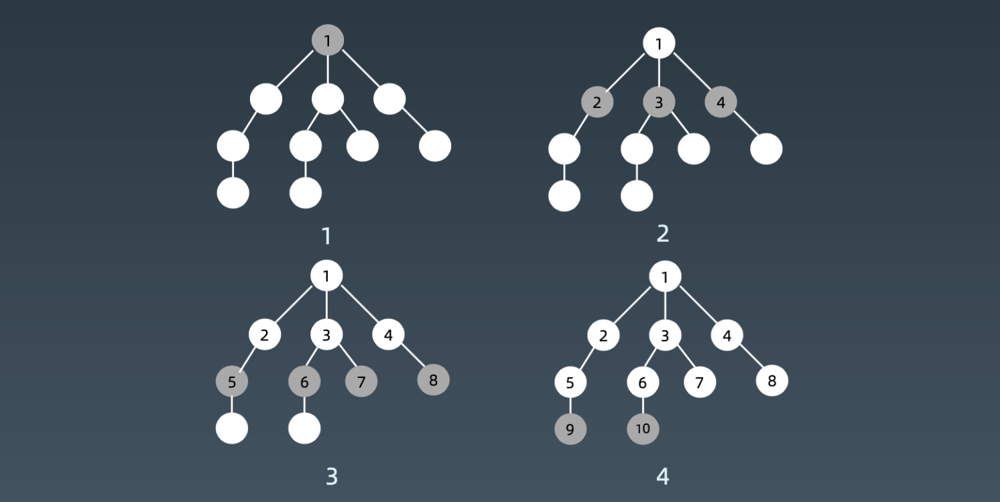

# 1. 深度优先搜索、广度优先搜索的实现和特性

关于搜索和关于遍历，他们要做的都一件事情。搜索来说的话，绝大部分都是暴力搜索或者简单朴素的搜索，也就是说没有所谓的智能的情况在考虑。很多情况下他们就是把所有的节点遍历一次，找到你想要的结果。

如果数据结构本身没有任何特点，例如很普通的树或者图，那么我们要做的事情就是遍历所有的点，同时保证每个点访问一次且仅访问一次。更具对节点访问的顺序不同可以区分为：

- 深度优先  depth first search
- 广度优先 breadth first search
- 优先级优先（ 更具业务场景、推荐算法）




深度优先从根节点开始，然后从左子树开始依次的走到底，然后再另一个。



广度优先从根节点开始，一层一层的向下扩展。

## 深度优先模版


```javascript
//JavaScript
const visited = new Set()
const dfs = node => {
  if (visited.has(node)) return
  visited.add(node)
  dfs(node.left)
  dfs(node.right)
}
```


## 广度优先模版
```javascript
//JavaScript
const bfs = (root) => {
  let result = [], queue = [root]
  while (queue.length > 0) {
    let level = [], n = queue.length
    for (let i = 0; i < n; i++) {
      let node = queue.pop()
      level.push(node.val) 
      if (node.left) queue.unshift(node.left)
      if (node.right) queue.unshift(node.right)
    }
    result.push(level)
  }
  return result
};
```

参考链接


- [DFS 代码模板（递归写法、非递归写法）](https://shimo.im/docs/UdY2UUKtliYXmk8t/)
- [BFS 代码模板](https://shimo.im/docs/ZBghMEZWix0Lc2jQ/)
